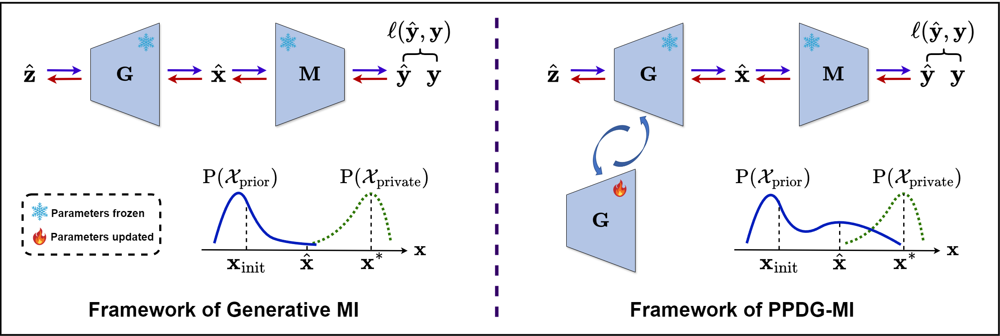

<h1 align="center">Pseudo-Private Data Guided Model Inversion Attacks</h1>
<p align="center">
    <a href="https://openreview.net/forum?id=pyqPUf36D2"></a>
    <a href="https://github.com/AlanPeng0897/PPDG-MI"></a>
    <a href="https://openreview.net/forum?id=pyqPUf36D2">  </a>
</p>

Hi, this is the code for our NeurIPS 2024 paper: *[Pseudo-Private Data Guided Model Inversion Attacks](https://openreview.net/forum?id=pyqPUf36D2)*.

**Overview of traditional generative MI framework vs. _pseudo-private data guided_ MI (PPDG-MI) framework.** PPDG-MI leverages pseudo-private data `\hat{\mathbf{x}}` generated during the inversion process, which reveals the characteristics of the actual private data, to fine-tune the generator `\mathrm{G}`. The goal is to enhance the density of `\hat{\mathbf{x}}` under the learned distributional prior `\mathrm{P}(\mathcal{X}_{\text{prior}})`, thereby increasing the probability of sampling actual private data `\mathbf{x}^*` during the inversion process.

# Getting started

## 1. High-resolution Setting (based on Plug & Play Attack)


### Setup Environment
We conducted all experiments on an Oracle Linux Server 8.9, utilizing NVIDIA Ampere A100-80G GPUs. The software environment included Python 3.9.18, PyTorch 1.13.1, and CUDA 11.7.

To create the conda environment with all the required dependencies, run:
```
conda env create -f high_resolution_environment.yml
```

---

### Setup StyleGAN2
For using our attacks with StyleGAN2, clone the official [StyleGAN2-ADA-Pytorch](https://github.com/NVlabs/stylegan2-ada-pytorch) repo into the project's root folder and remove its git specific folders and files. 
```
git clone https://github.com/NVlabs/stylegan2-ada-pytorch.git
rm -r --force stylegan2-ada-pytorch/.git/
rm -r --force stylegan2-ada-pytorch/.github/
rm --force stylegan2-ada-pytorch/.gitignore
```

To download the pre-trained weights, run the following command from the project's root folder or copy the weights into ```stylegan2-ada-pytorch```:
```bash
wget https://nvlabs-fi-cdn.nvidia.com/stylegan2-ada-pytorch/pretrained/ffhq.pkl -P stylegan2-ada-pytorch/
```
NVIDIA provides the following pre-trained models: ```ffhq.pkl, metfaces.pkl, afhqcat.pkl, afhqdog.pkl, afhqwild.pkl, cifar10.pkl, brecahad.pkl```. Adjust the command above accordingly. For the training and resolution details, please visit the official repo.

---

### Prepare Datasets
In this repository, we support [CelebA](https://mmlab.ie.cuhk.edu.hk/projects/CelebA.html) as datasets to train the target models. Please follow the instructions on the websites to download the datasets. Place all datasets in the folder ```data``` and make sure that the following structure is kept:

    .
    └── data       
        └── celeba
            ├── img_align_celeba
            ├── identity_CelebA.txt
            ├── list_attr_celeba.txt
            ├── list_bbox_celeba.txt
            ├── list_eval_partition.txt
            ├── list_landmarks_align_celeba.txt
            └── list_landmarks_celeba.txt

For CelebA, we used a custom crop of the images using the [HD CelebA Cropper](https://github.com/LynnHo/HD-CelebA-Cropper) to increase the resolution of the cropped and aligned samples. We cropped the images using a face factor of 0.65 and resized them to size 224x224 with bicubic interpolation. The other parameters were left at default. Note that we only use the 1,000 identities with the most number of samples out of 10,177 available identities. 

---

### Prepare Checkpoints for Target and Evaluation Models
Download the model weights for the experiments at this [cloud drive](https://drive.google.com/drive/folders/1BYcA4p7uPVqpBSiSRldq_nIY-zmH1n18?usp=sharing).


### Perform Attacks
* Baseline
```
CUDA_VISIBLE_DEVICES=0  python -W ignore attack_tuneG.py  --iterations=70 --num_round=1  --exp_name='baseline_id0-99' -c="configs/attacking/CelebA_FFHQ_tuneG.yaml"
```

* PPDG-PW
```
CUDA_VISIBLE_DEVICES=0  python -W ignore attack_tuneG.py  --iterations=70 --num_round=2  -m=pointwise  --num_inv_points=5  --exp_name='PPDG-PW_id0-99' -c="configs/attacking/CelebA_FFHQ_tuneG.yaml"
```

* PPDG-CT
```
CUDA_VISIBLE_DEVICES=0  python -W ignore attack_tuneG.py  --iterations=70 --num_round=2  -m=ct  --num_inv_points=10  --exp_name='PPDG-CT_id0-99' -c="configs/attacking/CelebA_FFHQ_tuneG.yaml"
```

* PPDG-MMD
```
CUDA_VISIBLE_DEVICES=0  python -W ignore attack_tuneG.py  --iterations=70 --num_round=2  -m=mmd  --num_inv_points=10  --exp_name='PPDG-MMD_id0-99' -c="configs/attacking/CelebA_FFHQ_tuneG.yaml"
```

## 2. Low-resolution Setting


### Setup Environment
We conducted all experiments on an Ubuntu 20.04.4 LTS system, equipped with NVIDIA GeForce RTX 3090 GPUs. The software environment included Python 3.7.12, PyTorch 1.13.1, and CUDA 11.6.

To create the conda environment with all the required dependencies, run:
```
conda env create -f low_resolution_environment.yml
```

---

### Prepare Datasets
In this repository, we support [CelebA](https://mmlab.ie.cuhk.edu.hk/projects/CelebA.html) and [FFHQ](https://drive.google.com/drive/folders/1tg-Ur7d4vk1T8Bn0pPpUSQPxlPGBlGfv) as datasets to train the target models. Please follow the instructions on the websites to download the datasets. Place all datasets in the ```datasets``` folder, maintaining the following directory structure. For datasets used in PLG-MI, please refer [PLG-MI Repository](https://github.com/LetheSec/PLG-MI-Attack).

    .
    └── datasets       
        ├── celeba
        │   ├── img_align_celeba
        │   └── meta
        │       ├── celeba_target_300ids_label.npy
        │       ├── celeba_target_300ids.npy
        │       ├── fea_target_300ids.npy
        │       ├── ganset.txt
        │       ├── testset.txt
        │       └── trainset.txt
        │
        │
        └── ffhq
            ├── thumbnails128x128
            └── meta
                └── ganset_ffhq.txt

---

### Prepare Checkpoints for Target and Evaluation Models
Download the model weights for the experiments at this [cloud drive](https://drive.google.com/drive/folders/1BYcA4p7uPVqpBSiSRldq_nIY-zmH1n18?usp=sharing).

---
### Perform Attacks

#### Configuration Parameters:
- Modify the configuration in 
  - `./config/celeba/attacking/celeba.json` if the target model is trained on CelebA.
  - `./config/celeba/attacking/ffhq.json` if the target model is trained on FFHQ.

#### Key Configuration Parameters:
- **`method`:** Select the attack method. Options are: `gmi`, `kedmi`, `brep`, and `rlb`.
- **`variant`** (used with `method=gmi/kedmi`): Select the attack variant. Options are: `baseline`, `aug`, `logit`, and `lomma`.
---

### Code examples:
- LOM (GMI):
Set `method` as `gmi` and `variant` as `logit`, and then run the following:

```
CUDA_VISIBLE_DEVICES=0 python -W ignore  white_recovery.py --configs=./config/celeba/attacking/celeba.json  --exp_name=PPDG-vanilla_id0-99  --iterations=1200  --num_round=2  --num_candidates=1000  --target_classes='0-100'
```

- LOM (KEDMI):
Set `method` as `kedmi` and `variant` as `logit`, and then run the following:

```
CUDA_VISIBLE_DEVICES=0 python -W ignore  white_recovery.py --configs=./config/celeba/attacking/celeba.json  --exp_name=PPDG-vanilla_id0-99  --iterations=1200  --num_round=2  --num_candidates=1000  --target_classes='0-100'
```

- PLGMI:
```
CUDA_VISIBLE_DEVICES=0 python -W ignore  recovery.py  --model=VGG16  --iterations=80  --public_data_root='./reclassified_public_data/facescrub/VGG16_top30'  --private_data_name=celeba  --public_data_name=facescrub  --target_classes='0-100'  --num_round=2  --exp_name=PPDG-vanilla_id0-100  --path_G=./checkpoints/GAN/facescrub_VGG16_PLG_MI_G.tar --path_D=./checkpoints/GAN/facescrub_VGG16_PLG_MI_D.tar  --num_candidates=200
```

- RLBMI:
Set `method` as `rlb` and then run the following:

```
CUDA_VISIBLE_DEVICES=0 python -W ignore  black_recovery.py --configs=./config/celeba/attacking/celeba.json  --exp_name=PPDG-vanilla_id0-9  --iterations=10000  --num_round=2  --num_candidates=1000  --target_classes='0-10'
```

- BREPMI:
Set `method` as `brep` and then run the followings:

```
CUDA_VISIBLE_DEVICES=0 python -W ignore  label_only_recovery.py --configs=./config/celeba/attacking/celeba.json  --exp_name=baseline_id0-9  --iterations=1000  --num_round=1  --num_candidates=1000  --target_classes='0-10  --max_radius=16.3'
```

```
CUDA_VISIBLE_DEVICES=0 python -W ignore  label_only_recovery.py --configs=./config/celeba/attacking/celeba.json  --exp_name=PPDG-vanilla_id0-9  --iterations=1000  --num_round=2  --num_candidates=1000  --target_classes='0-10  --max_radius=9.0'
```

---

# References
If you find this code helpful in your research, please consider citing
```bibtex
@inproceedings{peng2024PPDG,
title={Pseudo-Private Data Guided Model Inversion Attacks},
author={Peng, Xiong and Han, Bo and Liu, Feng and Liu, Tongliang and Zhou, Mingyuan},
booktitle={NeurIPS},
year={2024}
}
```

# Implementation Credits
Some of our implementations rely on other repos. We want to thank the authors ([PPA](https://github.com/LukasStruppek/Plug-and-Play-Attacks), [GMI](https://github.com/AI-secure/GMI-Attack), [KEDMI](https://github.com/SCccc21/Knowledge-Enriched-DMI), [LOMMA](https://github.com/sutd-visual-computing-group/Re-thinking_MI), [BREPMI](https://github.com/m-kahla/Label-Only-Model-Inversion-Attacks-via-Boundary-Repulsion), [RLBMI](https://github.com/HanGyojin/RLB-MI), and [PLG-MI](https://github.com/LetheSec/PLG-MI-Attack)) for making their code publicly available.😄
